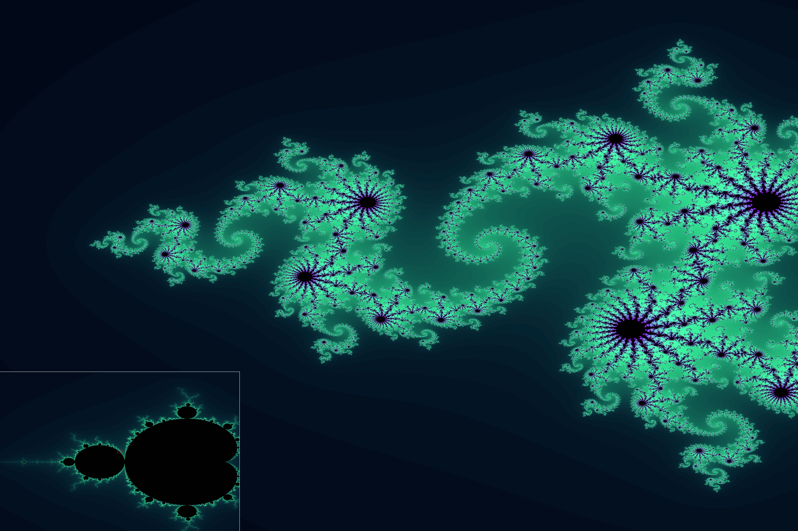

# Intro
This is a simple project to render [Julia Sets](https://en.wikipedia.org/wiki/Julia_set) and the [Mandelbrot Set](https://en.wikipedia.org/wiki/Mandelbrot_set) using the GPU.
## Mandelbrot Set
The Mandelbrot set is the set of complex numbers $c$ for which the function $f_i(c)$ does not diverge when iterated from $f_0(c) = 0$.
$$
\begin{align}
f_0(c) &= 0 \\
f_i(c) &= f_{i-1}(c)^2 + c
\end{align}
$$
Coloring is done using the number of iterations it takes for the function to 'diverge'.


## Julia Sets
Julia Sets use the same recursive function. But instead of starting at a $f_0(c) = 0$, they start at $J_0(c, j) = c$.
Additionally, instead of using $c$ as an offset, they use a constant offset which is given as an additional parameter $j$.

$$
\begin{align}
J_0(c, j) &= c \\
J_i(c, j) &= J_{i-1}(c, j)^2 + j
\end{align}
$$

Whenever this $j$ itself is in the mandelbrot set, the julia set will be connected. Otherwise, it will be disconnected.



# Dependencies
- OpenGL
- GLEW
- GLFW

Under Fedora, you can install the dependencies using the following command:
```bash
sudo dnf install mesa-libGL-devel glfw-devel glew-devel
```

# How to run
1. Clone the repository
2. Install the dependencies
3. Run the following commands:
    ```bash
    mkdir cmake-build-debug
    cd cmake-build-debug
    cmake ..
    make
    ./mandelbrot
    ```
4. You can control the camera using W, A, S, D, Shift, and Space
5. You can change the real and imaginary parts of the julia sets parameter $j$ using the arrow keys

# Limitations
- This program reaches numerical limits when zooming in too far. This is due to the limited precision of numbers in computers.